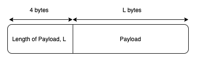

# Technical Document

## Systems Architecture

The following diagram illustrates the service architecture of the user authentication system.


There are 3 main components in this system:
1. **HTTP Server**
    - Handles all HTTP requests made by the browser/user
    - Packages all requests into protobuf messages and forwards them to the TCP server via RPC
    - Receives TCP server responses and renders web pages with HTML templating

2. **TCP server**
    - Responsible for all business logic and authentication service
    - Relies on:
        - Redis as in-memory cache
        - MySQL for user data persistence
        - Local file system for image persistence

3. **File server**
    - Serving of image files to users is offloaded from the TCP server to the file server
    - Users would send requests for image file directly to the file server


## HTTP Server

The following diagram illustrates the high level architecture of the HTTP server.


The HTTP server employs a layered architecture comprising the routers, controllers and views.

1. Routers
    - The routers are responsible for all HTTP requests routing logic.
    - Requests are routed to their respective controllers based on the request path and query strings.
2. Controllers
    - The controllers are responsible for parsing HTTP requests and to serialize the relevant data into appropriate RPC messages
    - These messages are then passed to the TCP server via the RPC client, which will be elaborated on further below.
        - The separation
    - When the TCP server responds, the response message is decoded and handled accordingly.
        - For instance, a successful login would return a corresponding session id.
        - The controller would then package this as a set-cookie header
        - The HTML template for the profile page is then executed using the user details retrieved from the TCP server
        - Finally, the rendered HTML is sent to the browser
3. Views
    - The views are responsible for all presentation logic
    - They contain HTML template files utilizing Golang's HTML control structures for easy rendering logic

### RPC

The RPC client is responsible for communicating with the TCP server via establishment of a connection pool.

**Connection Pool**

The connection pool allows a minimum set of connections with the TCP server to be kept alive.
Instead of opening a new connection with the TCP server each time a request is made, the controller calls a `Get()` function to obtain an existing connection from the pool.
Once communication between the controller and TCP server ceases, the connection is returned to the pool via a `conn.Close()` call, which abstracts away the return logic.
This alleviates the inefficiency associated with tearing down a connection and opening a new connection by reusing connections.

The following class diagram illustrates the associations within the connection pool.


Here, there are several points to note:
- `Pool` is initiated with a `PoolConfig`, which specifies certain settings:
    - `InitCap` is the number of initial connections made on initialisation
    - `MaxCap` is the max number of connections the pool can hold
    - `WaitTimeout` is the max duration for which a controller can wait for a connection before an error is returned
- `PoolConn` is a wrapper over `net.Conn`, allowing polymorphic behavior of `Close()`, which returns the connection to the pool rather than to actually close it
- The pool of connections is maintained in `connections`, a channel of `net.Conn`, while the number of slots available for creation of new connections is maintained in `availableSlots`, a channel of booleans.
    - By maintaining the number of available slots in a channel, it allows for effective use of the `select` block in `Get()` as seen below.
        - In this `select` block, in the first case - we first attempt to obtain an idle connection from the connection pool. 
        - If there are no connections available, in the second case - we attempt to create a new connection by receiving an available slot
        - If there are no slots available, the goroutine is blocked until a connection or slot is available
        - Finally, if `WaitTimeout` is reached while blocked, `Get()` returns with an error
    
```go
select {
    case conn := <-connections:
        if conn == nil {
            return nil, ErrClosed
        }
    
        return pool.WrapConn(conn), nil
    case <-pool.availableSlotsForConnection:
        pool.mu.Lock()
        defer pool.mu.Unlock()
    
        conn, err := factory()
        if err != nil {
            pool.AddSlotsForConnection()
    
            return nil, err
        }
    
        return pool.WrapConn(conn), nil
    case <-ctx.Done(): // if WaitTimeout is reached, return timeout error
        return nil, ctx.Err()
    }
}
```

**RPC Message Serialization**

As TCP is stream oriented and connections are reused, RPC messages must be serialized such that they can be extracted correctly and deserialized from the stream. 
As such, the message format employed here is simple.



Here, we make the assumption that the first 4 bytes will be received.
By prepending the length of the payload to the front, this allows us to create a buffer with the corresponding size of L bytes, and to read the next L bytes from the connection.
Thus, this allows for the entire message to be deserialized correctly.
A checksum verifying the integrity of the message is not necessary as TCP ensures data reliability and in order delivery.

Following this, the payload utilizes protocol buffers to serialize data.
This was preferred over JSON as protobuf messages can be used as the Interface Definition Language, allowing for consistent schemas to be used across services.
Furthermore, protobuf's binary message format results in smaller message sizes and faster performance.  

The following snippet illustrates the message format for encoding a User, as well as a sample format for the Login request and response.

```protobuf
message User {
  required uint64 user_id = 1;
  required string username = 2;
  required string password = 3;
  optional string nickname = 4;
  optional string profile_image = 5;
}

message LoginRequest {
  required string username = 1;
  required string password = 2;
}

message LoginRegisterResponse {
  enum ErrorCode {
    Ok = 0;
    InvalidUsername = 1;
    InvalidPassword = 2;
    MissingCredentials = 3;
    InternalServerError = 4;
  }

  optional User user = 1;
  optional string token = 2;
  optional ErrorCode error = 3;
}
```

### Example Flow

The following diagram illustrates the sample flow for a login request.


## TCP Server

### Architecture

The following diagram illustrates the high level architecture of the HTTP server.


Here, we see once again a layered, n-tier architecture. 
The following elaborates on the responsibility of each of the main components:

1. **Services**
    - This layer serves as the domain layer, which provide domain services that contain the business logic related to their respective domain objects
    - Services may contain any number of helper components, such as the `Hasher` for password hashing
2. **Repositories**
    - Repositories serve as an abstraction for encapsulating storage, retrieval, and search behavior, which emulates a collection of domain objects
    - They also utilize the Data Access Object pattern, which is an abstraction of data persistence and is database/table-centric
        - DAO works as a data mapping/access layer, hiding ugly queries.
3. **Common Infrastructure**
    - These serves as abstraction over the underlying database and in-memory key-value store
    
### Database Schema

The following table illustrates the schema of the user table.


With lookups commonly made on `username`, no extra indexes are necessary as `username` being `UNIQUE KEY` automatically creates a `UNIQUE` index.

#### Sharding

In order to simulate horizontal scaling, hash based sharding is used.
- 10 shards are created, with the hash function of `shard_id = username[0] % 10`
- This allows for even distribution of data, thereby faster queries as less rows have to be searched

### Example Flow

The following diagram illustrates the sample flow for a login request.

